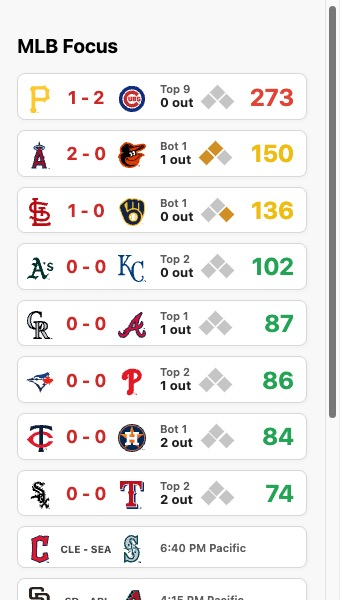

# mlb-focus-detector

[🇨🇳](./README.zh.md)

This is a Chrome/Edge extension that displays live MLB games with a focus score representing game intensity.

## Features

- Shows teams, scores, inning, and outs  
- Color-coded focus score (higher = redder, lower = bluer)  
- Visual base runner display  
- Click a game to open its MLB Gameday page  
- Click the focus score to open the MLB.TV stream  

## Focus Logic

The focus score measures how critical the current game situation is. It's calculated using:
- Inning and half-inning (with bonus weight after the 7th)
- Score difference
- Base/out state
- Win expectancy shift if runs are scored

Final score is normalized to an integer, where 100 represents the start of the game.  
The more a scoring event would swing the win probability, the higher the focus score.

## How to Use

### Install the extension manually

1. Download and unzip the `extension.zip` file from this repository  
2. Open **Chrome** or **Edge**, go to `chrome://extensions`  
3. Enable **Developer Mode**  
4. Click **“Load unpacked”**, and select the unzipped `extension` folder  
5. The extension icon should now appear in your toolbar  

### Use the extension

- Click the extension icon to view today's MLB games  
- Click a game to open its **MLB Gameday** page  
- Click the **focus score** to open its **MLB.TV** stream  
- Right-click the icon to set your **favorite** and **followed** teams — those games will be prioritized  
